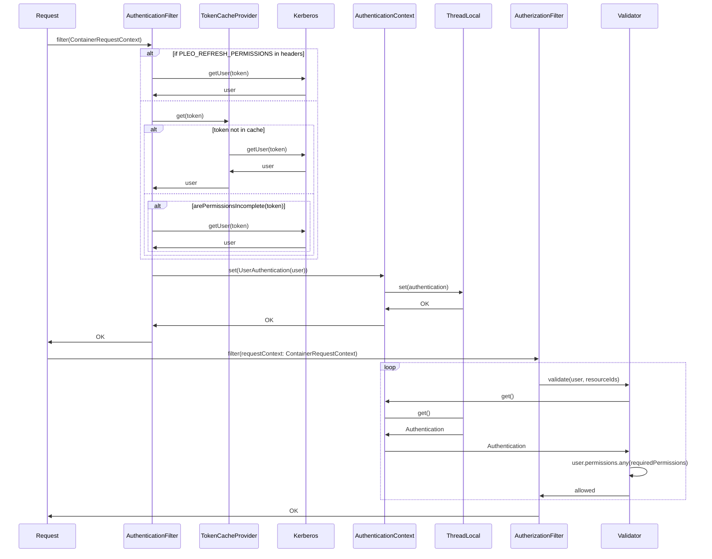
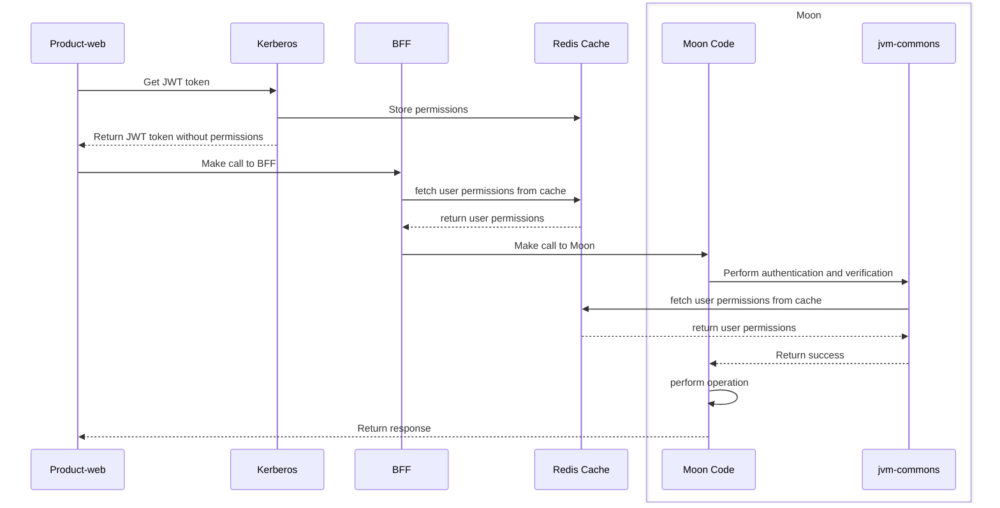
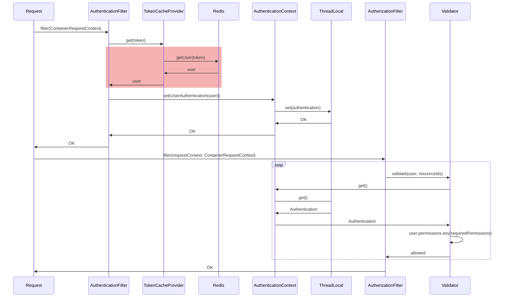
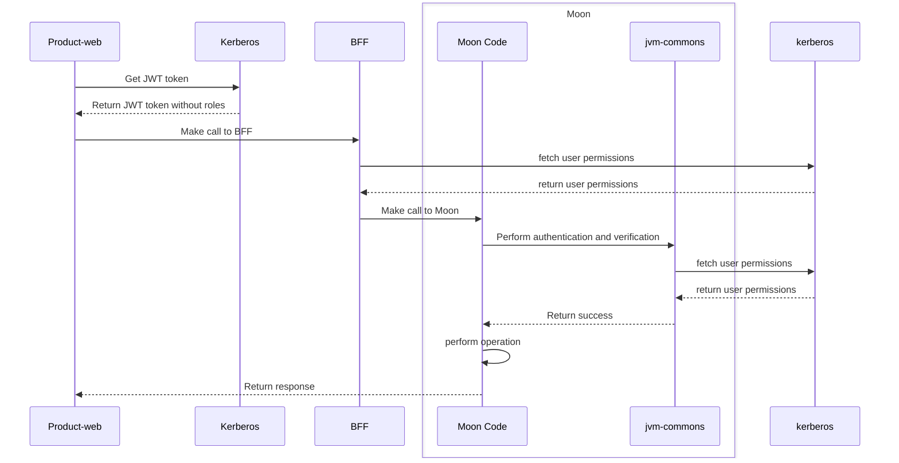

# 1. JWT size reduction

Date: 2024-02-06

## Status

Accepted

## Summary

Using Redis cache to store user permissions instead of storing them in the JWT token.
It will reduce the size of the token and the risk of hitting HTTP headers limits.

## Motivation

### Context

Currently, there are three authentication methods for requests to a moon: User, Client, and ExternalClient.
The User method is designed for authenticating requests from customers using any Pleo apps, such as product-web, mobile, or backoffice.
It leverages JWT for both authentication and authorization, with each token embedding the user's permissions.
These permissions are then evaluated by the backend service handling the request.
Annotations within each endpoint, for either Kotlin or Node.js moons, define the required permissions for access.
Upon receiving a request, the middleware verifies if the provided token includes the necessary permissions, thereby avoiding the need to contact the Auth server (kerberos) for validation.

#### Current user authentication flow in JVM-Commons module



As Pleo grows and the clients demand more fine-grained control this has resulted in a growing number of permissions added to the JWT, which has resulted in the token
reaching [hard limits](https://stackoverflow.com/questions/3326210/can-http-headers-be-too-big-for-browsers/3436155#3436155).

In order to mitigate the problem, there has been previous attempts, such as: [Separate authentication from authorisation](https://www.notion.so/Separate-authentication-from-authorisation-071a9809fad34e92914ca278fda3c475?pvs=21)

In spite of those efforts, there are still many tokens reaching to a considerable
size ([logs](https://app.datadoghq.eu/logs?query=service:kerberos%20env:product-production%20%22JWT%20Token%20close%22%20status:warn&agg_m=count&agg_t=count&cols=host,service&context_event=AYXsdHi-AABGxJz3UhzeJQAQ&index=&messageDisplay=inline&stream_sort=time,desc&viz=stream&from_ts=1706510107345&to_ts=1706524507345&live=true))
and some of them being rejected due to the header being too
large ([logs](https://app.datadoghq.eu/logs?query=env:product-production%20%22Header%20is%20too%20large%22&agg_m=count&agg_q=service&agg_t=count&cols=host,service&index=*&messageDisplay=inline&source=monitor_notif&stream_sort=desc&viz=stream&from_ts=1704186296259&to_ts=1704272696259&live=true)).
It is expected that this problem will get worse as Pleo target more mid-market companies. Additionally such big tokens can produce an increase in traffic cost, latency of requests and usage of resources in the services.

### Goals

The goal of the proposals presented in this document is to have a solution to the immediate problems related with the token size with the minimal intervention,
lowest maintenance possible by kerberos stewards and that can be as transparent as possible to the product teams.

- Reduce the JWT size so there is no more risk to hit HTTP headers limits
- Product teams don’t need to change code in their endpoints to adapt to the new changes

### Non-Goals

It is not the goal of the proposals presented to provide a long term solution since this depends on an overhaul of the permission model across the company.

## Decision

### Design

#### Shared Redis

In this approach, moons obtain tokens from a globally shared Redis instance. When a JWT is issued, Kerberos stores the permissions in this shared cache with the same expiration as the token and issues a JWT without permissions to the user. Should a
user's permissions change, Kerberos has the ability to remove or invalidate tokens related to that user. The primary benefit of this method is its simplicity in terms of required code modifications, alongside the scalability offered by Redis, known
for its speed and reliability. However, the drawbacks include the potential for increased costs due to setting up a Redis cluster, as well as introducing a single point of failure.

The recommendation is to go with the shared Redis solution due to its advantages.
Redis is known for its high performance, scalability, and high availability.
It serves as an efficient caching solution, allowing for the distribution of data and storage of web sessions.
Redis also supports horizontal and vertical scalability, making it a suitable choice for accommodating increased traffic without much effort.
Additionally, it simplifies middleware code and can help avoid calling Kerberos, which aligns with the low-effort requirement mentioned in the original statement.
Therefore, the shared Redis solution is a favorable option based on its pros and the specific considerations mentioned.

##### High level sequence diagram



##### JVM-Commons sequence diagram



#### Cost

Currently we lack visibility in the number of User authentications performed, so if we go with a high traffic estimation of 10000 req/sec and 1 GB of data stored the cost would be 202 USD per month:

##### Calculation

##### Unit conversions

Average simple request rate: 10000 per second * (60 seconds in a minute x 60 minutes in an hour x 730 hours in a month) = 26280000000 requests per month

##### Pricing calculations

1 GB-hour(s) x 730 hours in a month = 730.00 GB-hour(s)

730.00 GB-hour(s) x 0.14 USD = 102.20 USD for total data storage cost

**Total data storage cost: 102.20 USD**

26,280,000,000 requests x 1 KBs = 26,280,000,000.00 Total ECPU consumption

26,280,000,000.00 ECPU(s) x 0.0000000038 USD = 99.864 USD

**Total ECPU Cost: 99.864 USD**

102.20 USD for data storage + 99.864 USD for ECPU = 202.064 USD for total elasticache serverless cost

**Total ElastiCache Serverless Cost (monthly): 202.064 USD**

#### Rollout steps

1. Deploy Redis with replicas
2. Set LaunchDarkly feature flag to write to Redis and return just a `tokenid` on tester customers
3. JVM-Commons to fetch JWT from Redis depending on feature flag
4. Test functioning in a test service with the test customer
5. Run campaign for moons to be in the latest `jvm-commons` version
6. Rollout percentage of customers to feature-flag and monitor
7. Cleanup feature flag

### Open questions

- What is the real cost?
- How is the token format iterated?

### Alternatives

#### JWT core permissions

The main idea of this proposal is to leave the most common permissions in the token, and call the authorization service only on demand.
This proposal would not require any change from product teams, other than upgrading to the latests jvm-commons version, as it would be completely managed by the middleware.

##### High level sequence diagram



There are three main implementations possible:

- Include flag in the JWT to mark it as incomplete: Currently the middleware code checks if the token is incomplete by checking if the permissions are for a partner or multi-entity or has the dummy permission given for the departmentReviewer
  permission (ref). The change proposed would consist in including a field in the JWT to explicitly indicate the token is incomplete.

    ```mermaid
    sequenceDiagram
        participant r as Request
        participant a as AuthenticationFilter
        participant c as TokenCacheProvider
        participant k as Kerberos
        participant at as AuthenticationContext
        participant tl as ThreadLocal
        participant ath as AutherizationFilter
        participant v as Validator
        r ->> a: filter(ContainerRequestContext)
        alt if PLEO_REFRESH_PERMISSIONS in headers
            a ->> k: getUser(token)
            k ->> a: user
        else
            a ->> c: get(token)
            alt token not in cache
                c ->> k: getUser(token)
                k ->> c: user
                c ->> a: user
            else
                rect rgba(220, 0, 0, 0.3)
                    alt arePermissionsIncomplete(token)
                        Note over a, k: This verifies the JWT flag
                        a ->> k: getUser(token)
                        k ->> a: user
                    end
                end
            end
        end
        a ->> at: set(UserAuthentication(user))
        at ->> tl: set(authentication)
        tl ->> at: OK
        at ->> a: OK
        a ->> r: OK
        r ->> ath: filter(requestContext: ContainerRequestContext)
        loop
            ath ->> v: validate(user, resourceIds)
            v ->> at: get()
            at -> tl: get()
            tl ->> at: Authentication
            at ->> v: Authentication
            v ->> v: user.permissions.any(requiredPermissions)
            v ->> ath: allowed
        end
        ath ->> r: OK
    ```

    - Pros
        - Minimal changes required
    - Cons
        - There will be unnecessary calls to Kerberos, as it would call it even if the permissions are not required by any endpoint

- Retrieve the User only on missing permissions: In this implementation the decision to retrieve the User from Kerberos will be moved to the authorization phase instead on the authentication.

    ```mermaid
    sequenceDiagram
    	participant r as Request
        participant a as AuthenticationFilter
        participant c as TokenCacheProvider
        participant k as Kerberos
        participant at as AuthenticationContext
        participant tl as ThreadLocal
        participant ath as AutherizationFilter
        participant v as Validator
        participant u as UserProvider
        r->>a: filter(ContainerRequestContext)
            alt if PLEO_REFRESH_PERMISSIONS in headers
            a->>k: getUser(token)
            k->>a: user
        else 
            a->>c: get(token)
    		alt token not in cache
                c->>k: getUser(token)
                k->>c: user
            end
            c->>a: user
        end
        a->>at: set(UserAuthentication(user))
    		at->>tl: set(authentication)
    		tl->>at: OK
        at->>a: OK
        a->>r: OK
        r->>ath: filter(requestContext: ContainerRequestContext)
    	loop
    		ath->>v: validate(user, resourceIds)
            v->>at: get()
            at->tl: get()
            tl->>at: Authentication
            at->>v: Authentication
            v->>u: user.permissions.any(requiredPermissions)
            rect rgba(220, 0, 0, 0.3)
            alt is not requiredPermissions in user.permissions?
            u->>k: getUser(token)
            k->>u: user
            end
            end
            u->>v: validated
            v->>ath: allowed
        end
        ath->>r: OK
    ```

    - Pros
        - It will only call Kerberos if the permissions are required by the endpoint
    - Cons
        - Requires not straightforward changes in the middleware
        - It cannot differentiate an incomplete token against an unauthorized call until it calls Kerberos, so there will be unnecessary calls.

- Combine the two: In order to call Kerberos only when it strictly necessary it will be needed to combine both solutions. When an endpoint requires permissions that are not in the token, first it checks that the token is incomplete, and only then
  call Kerberos

    ```mermaid
    sequenceDiagram
    	participant r as Request
        participant a as AuthenticationFilter
        participant c as TokenCacheProvider
        participant k as Kerberos
        participant at as AuthenticationContext
        participant tl as ThreadLocal
        participant ath as AutherizationFilter
        participant v as Validator
        participant u as UserProvider
        r->>a: filter(ContainerRequestContext)
            alt if PLEO_REFRESH_PERMISSIONS in headers
            a->>k: getUser(token)
            k->>a: user
        else 
            a->>c: get(token)
    		alt token not in cache
                c->>k: getUser(token)
                k->>c: user
            end
            c->>a: user
        end
        a->>at: set(UserAuthentication(user))
    		at->>tl: set(authentication)
    		tl->>at: OK
        at->>a: OK
        a->>r: OK
        r->>ath: filter(requestContext: ContainerRequestContext)
    	loop
    		ath->>v: validate(user, resourceIds)
            v->>at: get()
            at->tl: get()
            tl->>at: Authentication
            at->>v: Authentication
            v->>u: user.permissions.any(requiredPermissions)
            rect rgba(220, 0, 0, 0.3)
            alt is not requiredPermissions in user.permissions? and user.incomplete?
            u->>k: getUser(token)
            k->>u: user
            end
            end
            u->>v: validated
            v->>ath: allowed
        end
        ath->>r: OK
    ```

    - Pros
        - It will only call Kerberos if it is strictly required
    - Cons
        - The most complex solution in terms of code changes

#### Performance considerations

The main drawback of this solution is that it will drive more traffic to Kerberos. The exact amount of traffic increase will depend on the following variables:

- Permissions included in the token: The more permissions included in the token the less requests to Kerberos are needed, but also the riskier it is to reach to the limit and the more information is transmitted in every request
- To have an accurate estimation of the traffic increase it is needed to get the distribution of permissions required. If permissions required by endpoints are clustered into just a few ones, this solution will be more efficient as just a few
  permissions in the token would allow to reduce drastically the number of requests. For example, if just the same 5 permissions are used by 98% of requests, only the rest would need a call to Kerberos.
- If the load to Kerberos is high enough it will be necessary to introduce some caching mechanism, such as Vagrant or Redis

#### Rollout steps

1. Change JVM-Commons in order to fetch permissions when token is incomplete
1. Create metrics in JVM-Commons to capture the usage of permissions
1. [Optional] Set LaunchDarkly feature flag to set the permissions to include/exclude
1. Set LaunchDarkly flag to generate incomplete tokens for only a subset of customers
1. Test functioning in a test service with the test customer
1. Run campaign for moons to be in the latest `jvm-commons` version
1. Enable LaunchDarkly flag to everyone
1. [Optional] Set up caching solution for Kerberos [Redis/Vagrant]
1. Cleanup feature flag

#### Open questions

- What to do with Node.js moons?
- How to decide which fields to include in the core permissions?
    - It is needed more metrics to be added to monitor the longest permissions. So far
- What should be the traffic increase to Kerberos?
- Can logic for incomplete token be removed?

## Further Considerations

### Prior Art

None

### Next Steps

1. Deploy Redis with replicas
1. Set LaunchDarkly feature flag to write to Redis and return just a `tokenid` on tester customers
1. JVM-Commons to fetch JWT from Redis depending on feature flag
1. Test functioning in a test service with the test customer
1. Run campaign for moons to be in the latest `jvm-commons` version
1. Rollout percentage of customers to feature-flag and monitor
1. Cleanup feature flag
